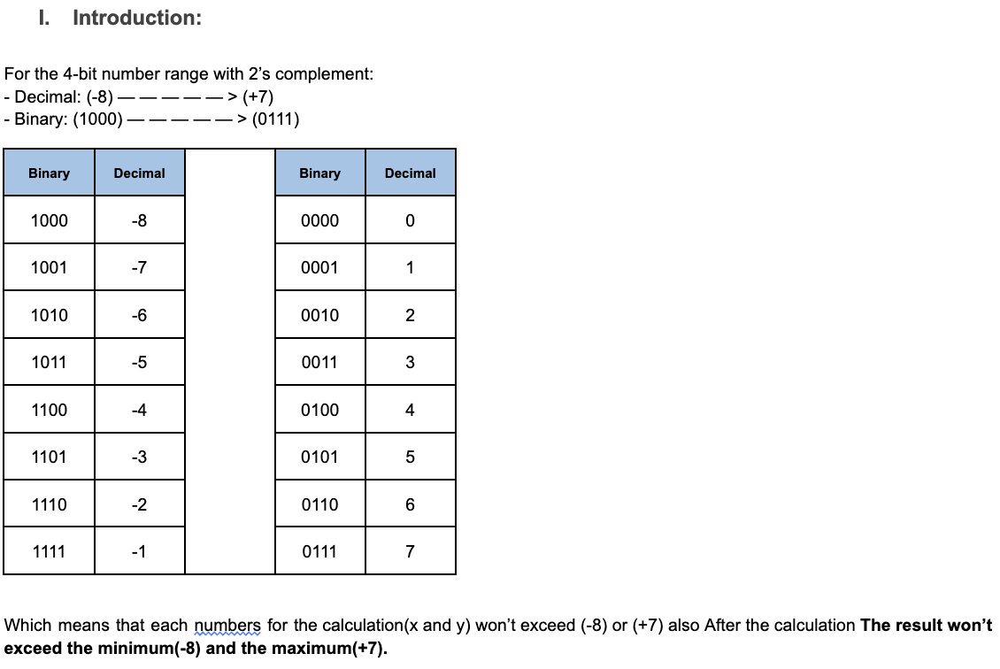
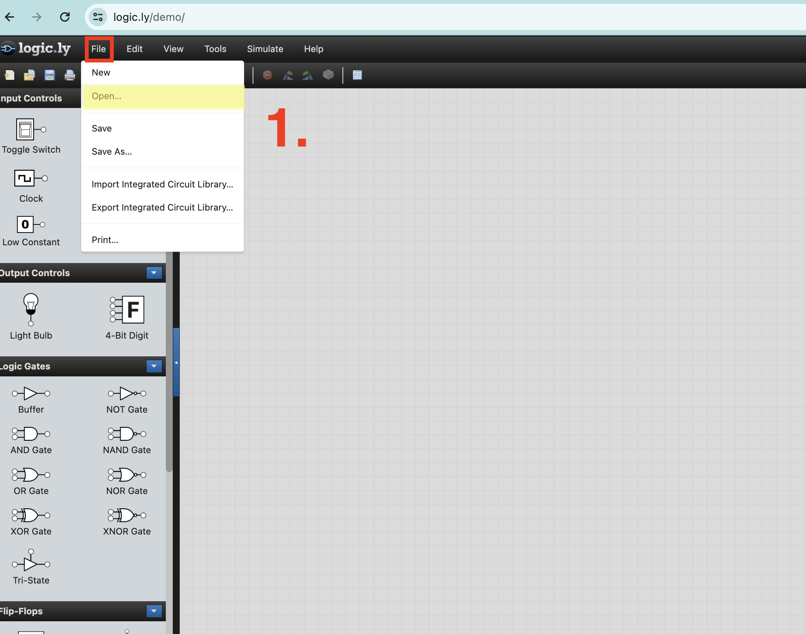
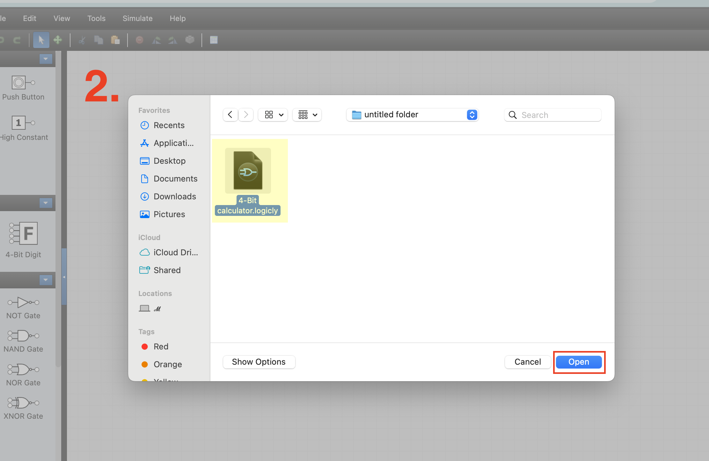
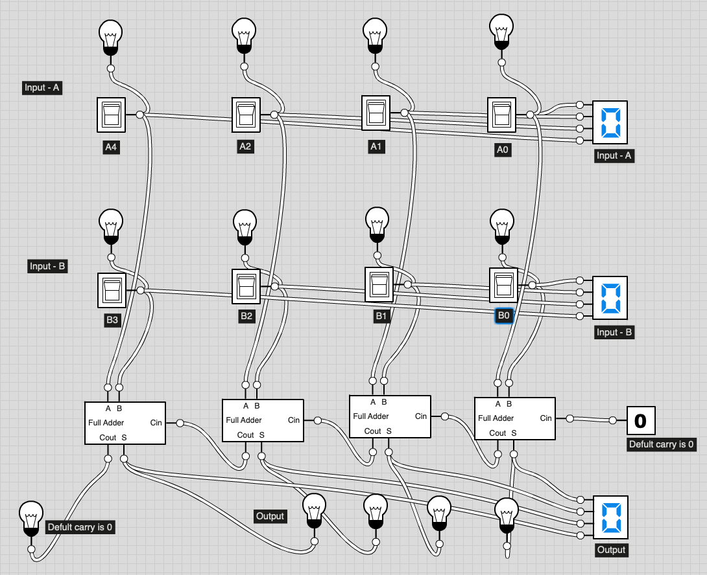
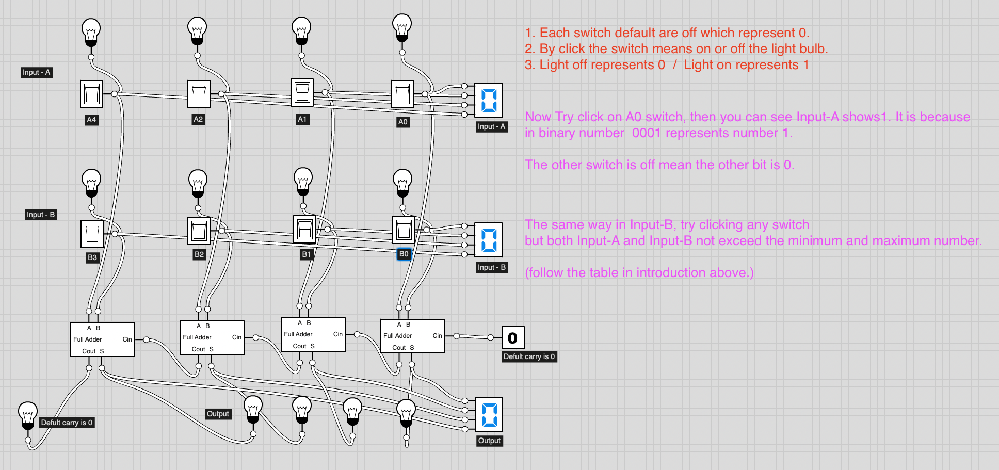
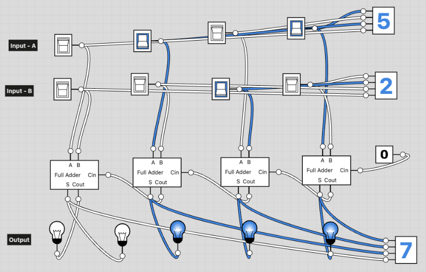

## Instruction Guide

Now let’s understand the introduction bellow and the interface of the logic circuit:

To use the 4bit calculator:
1. download `4-Bit calculator.logicly` to your device. you can get in the box above.
   
2. go to https://logic.ly/demo/  then follow the fellow step:
    - Click the `open` from file
      

    - select downloaded file and then click `open`
      

## 1. Addition:

- **Testing**
   - 

## 2. Substration:

- **Testing**
   - 

